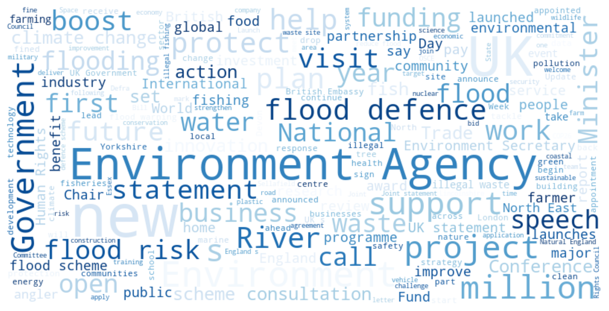
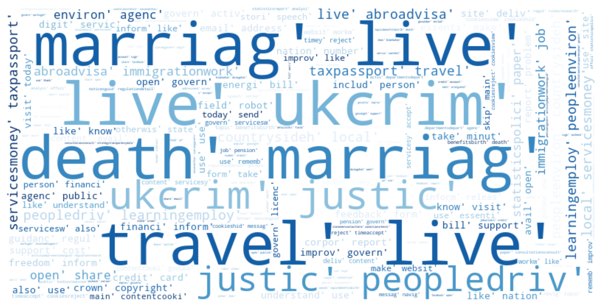
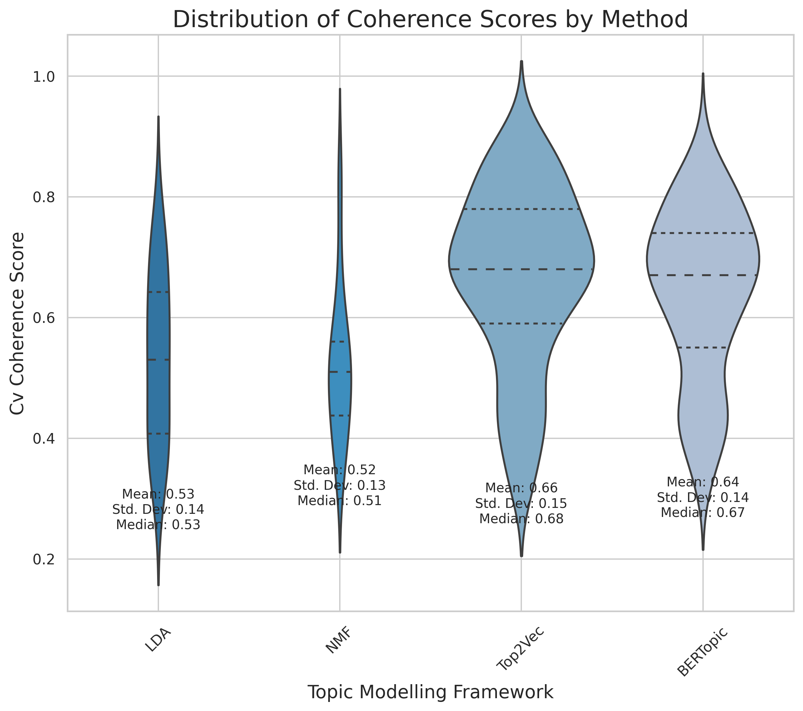

# UCL Business Analytics MSc: Dynamic Topic Modelling Project 

Welcome to this comprehensive repository of a dissertation project undertaken for the Business Analytics MSc at University College London (UCL). This repository presents an empirical exploration into the field of dynamic topic modelling, with a specific focus on the environmental policy discourse.

## 🎯 Project Objective 

This project was designed with a dual focus:

1. Perform an in-depth critical assessment and comparison of four prevailing dynamic topic modelling frameworks, namely Non-Negative Matrix Factorization (NMF), Latent Dirichlet Allocation (LDA), Top2Vec, and BERTopic.
2. Leveraging these dynamic topic modelling techniques, the project aims to analyse public discourse on environmental topics. The insights gained from this analysis can provide a  tool to assist policymakers in media coverage assessment, alignment of messaging with current trending issues, and devising more nuanced, effective, and responsive strategies. 

## 📊 Data Source and Collection

The data utilized in this study was  collected from the GOV.uk website. We employed web scraping techniques and managed to gather a  corpus of 5898 articles from the news section, using "environment" as a keyword.

  
   

**Figure 1 & 2:** These word clouds represent the frequency of words appearing in the titles and content of the articles from the Gov.UK corpus (01/01/2012 to 01/05/2023). The word frequency is proportional to the size of the word in the cloud.

## 📈 Results

  
  

**Figure 3:** This is a visual representation of Top2Vec Dynamic Topic 1, featuring key terms like "wast", "legitim", "topicwast", and "crime". The plot is based on the Gov.UK corpus from 01/01/2012 to 01/05/2023.

**Figure 4:** This plot depicts BERTopic Dynamic Topic 19, highlighting keywords such as "ivori", "Africa", "UK", "eleph", "African", "Uganda", "ban", and "trade". The data comes from the Gov.UK corpus spanning 01/01/2012 to 01/05/2023.

    

**Figure 5:** This violin plot demonstrates the distribution of CV Coherence Scores from four distinct topic modelling methods: Latent Dirichlet Allocation (LDA), Non-negative Matrix Factorization (NNMF), Top2Vec, and BERTopic. The coherence scores are represented on a scale from 0 to 1, where a higher value is indicative of better topic quality. The corpus is sourced from Gov.UK (01/01/2012 to 01/05/2023).

## 🎓 Dissertation Findings 

The study revealed that neural network-based techniques, specifically Top2Vec and BERTopic, surpassed traditional models such as LDA and NMF in both static and dynamic environments. An interesting finding was that BERTopic was more responsive to short-term fluctuations, while Top2Vec showcased more stability, albeit at the cost of contextual awareness. Hence, BERTopic was found more suitable when analysing specific short-term topics, while Top2Vec performed better for tracking broader, long-term subjects. The insights derived from our dynamic topic modelling approach can be immensely beneficial for policymakers and stakeholders to gauge media coverage, align messaging with trending issues, and formulate strategies with more efficacy and responsiveness.

## 📁 Repository Structure

- **Data**: 
  - `URL.json`: URLs of the scraped articles
  - `articles.json`: Content, title, and date of each article
  
- **Dynamic_BERTopic**: 
  - `my_model`: Saved BERTopic model
  - `saved_plots`: Plots from the dynamic topic modelling approach
  - `saved_plots_SE`: Plots from the dynamic topic modelling approach with standard error
  - `Dynamic_Bert.ipynb`: Jupyter notebook for hyperparameter tuning, model execution, and analysis
  - `requirements.txt`: Necessary dependencies
  
- **Dynamic_Latent_Dirichlet_Allocation**: 
  - `LDA_saved_model`: Saved LDA model
  - `Saved_plot`: Plots from the dynamic topic modelling approach
  - `saved_plots_SE`: Plots from the dynamic topic modelling approach with standard error
  - `Dynamic_LDA.ipynb`: Jupyter notebook for hyperparameter tuning, model execution, and analysis
  - `requirements.txt`: Necessary dependencies
  
- **Dynamic_Non_Negative_Matrix_Factorization**: 
  - `nmf_model`: Saved NMF model
  - `Saved_plot`: Plots from the dynamic topic modelling approach
  - `saved_plots_SE`: Plots from the dynamic topic modelling approach with standard error
  - `Dynamic_NMF.ipynb`: Jupyter notebook for hyperparameter tuning, model execution, and analysis
  - `requirements.txt`: Necessary dependencies
  
- **Dyanmic_Top2Vec**: 
  - `Top2Vec_model`: Saved Top2Vec model
  - `Saved_plot`: Plots from the dynamic topic modelling approach
  - `saved_plots_SE`: Plots from the dynamic topic modelling approach with standard error
  - `Dynamic_Top2Vec.ipynb`: Jupyter notebook for hyperparameter tuning, model execution, and analysis
  - `requirements.txt`: Necessary dependencies
- **Web_Scraper**:
  - `Web_Scraper`: script the scrape the article's content, title and date 
  - `myspider`: crawler that scrapes the list of URL's from the Gov.uk website
- `Plot.py`: Python file with functions for plotting model outputs, implementing EMA, calculating standard error, and evaluating topic coherence

- `Preprocessing.py`: Python file carrying out all preprocessing steps
  
